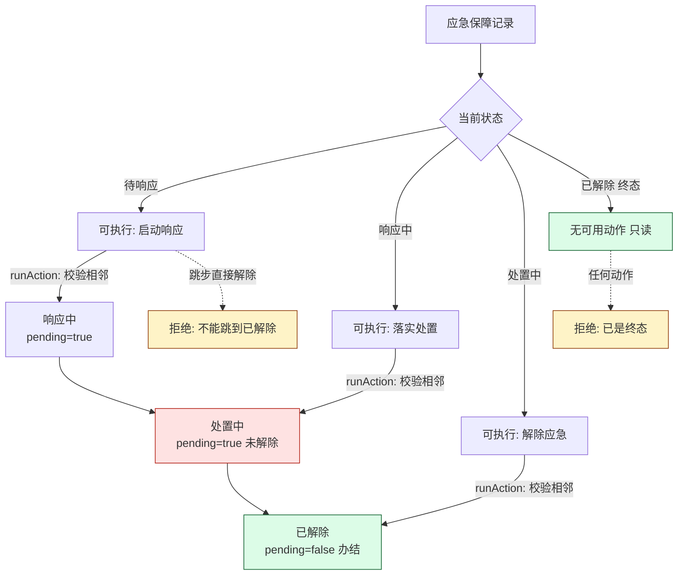
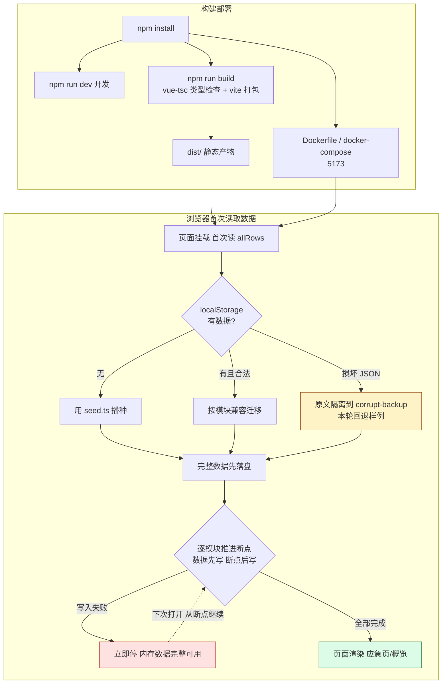
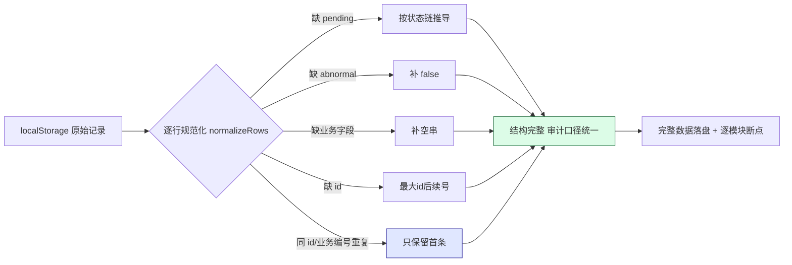

# 应急保障链路核对

> 核对范围：应急保障（`air_emergency`）模块从登记字段到状态流转的运行路径；前端的构建、部署、
> 本地数据加载（含兼容迁移）每一步；以及与「运营概览」页共用的审计标记。
>
> 核对方式：通读源码 + `npm run verify:data`（33 项断言，覆盖链路顺序、审计口径、缺字段迁移、
> 重复样例去重、断点续迁、终态保护）。

## 1. 业务链路：应急编号 → 事件类型 → 响应等级 → 处置措施

应急保障的字段、状态、动作都登记在 `frontend/src/data/modules.ts` 的 `air_emergency` 元数据里：

| 环节 | 内容 | 来源 |
| --- | --- | --- |
| 业务字段 | 应急编号、事件类型、涉及航班、事发位置、响应等级、响应人员、处置措施、应急状态 | `modules.ts` meta.fields |
| 状态链 | 待响应 → 响应中 → 处置中 → **已解除（终态）** | `modules.ts` meta.statuses |
| 动作链 | 启动响应 → 落实处置 → 解除应急 | `modules.ts` meta.actions / actionTargets |
| 页面 | `views/air_emergency/index.vue`（只渲染、不判业务） | — |
| 流转判定 | `api/local-service.ts` 的 `checkAction / runAction` | 唯一可改状态处 |

**运行路径**：页面渲染表格 → 每行按当前状态用 `availableActions()` 只放出合规动作 → 点击动作调用
`runAction()` → `checkAction()` 做三重校验（动作是否登记 / 是否终态 / 是否跳步）→ 改写
`status / pending / abnormal` → `saveRows()` 落 localStorage → 页面 `reload()`。

关键约束（`checkAction`）：

1. **终态保护**：当前已是「已解除」时，任何动作都拒绝，办结记录不会被改回去。
2. **不可跳步**：正向动作只能落在状态链的相邻环节，「待响应」不能直接「解除应急」。
3. **反向动作例外**：撤销/作废/驳回等（`NEGATIVE_ACTIONS`）不走正向链，命中即打 `abnormal` 审计标记。



页面三张指标卡（动态统计，不再是硬编码 0）：

- 待响应事件 = 状态「待响应」条数；
- 处置中事件 =「响应中」+「处置中」条数（两者都还**没解除**）；
- 已解除事件 =「已解除」条数。

## 2. 构建、部署、本地数据加载

- **开发**：`npm run dev`（Vite，监听 `127.0.0.1:5173`，不自动开页、无 `/api` 代理）。
- **构建**：`npm run build` = `vue-tsc --noEmit`（严格类型检查）+ `vite build`，产物 `dist/`。
- **部署**：仓库自带 `frontend/Dockerfile`（node:20-alpine 跑 dev server，容器内 `--host 0.0.0.0`）
  与 `docker-compose.yml`（映射 5173）；生产静态产物可由任意静态服务器托管，纯前端、无后端。
- **本地数据加载**：首次打开用 `seed.ts` 播种；之后读写 `localStorage`，键 `airport-ground-handling:entries`。



## 3. 与运营概览共用的审计标记

审计标记只有一套口径，集中在 `frontend/src/data/audit.ts`，应急页和概览页都消费它：

| 标记 | 含义 | 派生规则 |
| --- | --- | --- |
| `pending` | 待处理 / 未办结 | 状态 **不是** 该模块状态链最后一个状态即为 true |
| `abnormal` | 异常审计标记 | 命中过撤销/作废/驳回等反向动作即为 true，且一旦置 true 永久保留 |

- 应急保障终态是「已解除」，所以「处置中」`pending=true`，**不会被当成已完成**。
- 运营概览（`Dashboard.vue` → `loadOverview()`）直接读同一批迁移后的 `pending / abnormal`，
  两个页面口径一致；表头已注明「待处理（未办结）」「异常量（审计标记）」。

## 4. 兼容迁移的四条保证

实现在 `frontend/src/data/local-store.ts`，版本断点键 `…:entries:schema`（当前 `SCHEMA_VERSION=2`）。

1. **不改变状态含义**：迁移只补审计标记和缺失字段，不改写任何状态文案；终态仍由元数据状态链决定。
2. **缺字段记录兼容迁移**：缺 `pending` 按状态链推导、缺 `abnormal` 补 false、缺业务字段补空串、
   缺 `id` 从现有最大 id 之后补号；已有的 `abnormal:true` 作为审计痕迹保留。
3. **重复上线不产生重复样例**：首次播种整批写入；按 `id + 首个业务编号` 判重；
   旧版本缺整个模块时补播种且幂等，重开/多开不会追加重复行。
4. **配置失败从断点继续**：内存里先得到完整数据，落盘时「完整数据先写、模块断点后写」，
   中途任何一步写失败都立即停下，页面仍用内存完整数据；下次打开从断点模块继续，迁移可重入。
   整份 JSON 损坏时把原文隔离到 `…:corrupt-backup` 再回退样例，绝不用半截数据覆盖原记录。



## 5. 如何复核

```bash
cd frontend
npm install
npm run verify:data   # 33 项断言：链路顺序/审计口径/迁移/去重/断点/终态
npm run build         # 类型检查 + 生产构建
npm run dev           # 手工打开 http://127.0.0.1:5173/air_emergency
```

浏览器里想回到初始数据：清掉 `airport-ground-handling:entries`（及 `…:schema`、`…:corrupt-backup`），
或调用 `resetModule('air_emergency')`。

## 6. 核对中发现并处理/记录的点

- 应急页指标卡原先硬编码为 0、未随数据变化 → 已改为按状态动态统计。
- 应急页原先对所有记录都渲染全部三个动作、且服务层允许任意跳转/终态再操作 → 已加链路顺序与终态保护。
- seed 中应急 id=3「处置中」原 `pending:false`（与"未解除不算办结"矛盾）→ 已改为 `true`；
  其余模块样例存在同类历史标记偏差，统一由迁移/流转在运行时按状态链校正，不逐条改状态。
- 样例应急编号形如 `AIR_-0001`（生成器前缀拼接产物）属历史数据，本次未改动业务编号以免影响存量。
